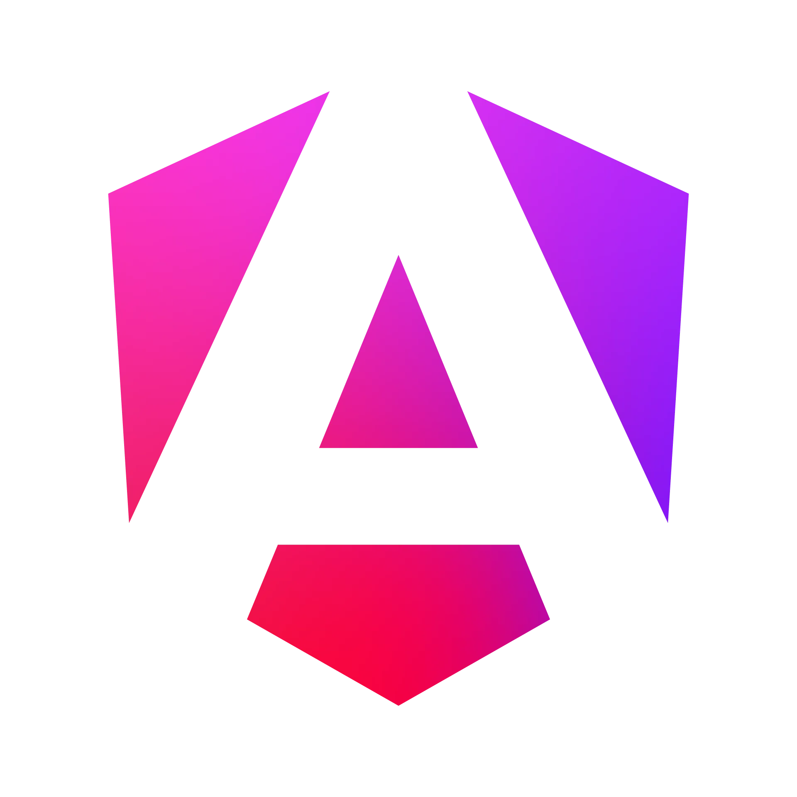

<h1 style="font-weight: 500; background: linear-gradient(to right,#8514f5,#f637e3,#fa2c05); -webkit-background-clip: text; background-clip: text;-webkit-text-fill-color: transparent;">ng-milkdown</h1>


<span style="font-size: 30px;color: #aaa;margin: 0 20px;">+</span>


WYSIWYG markdown Editor 🍼 [**Milkdown**](https://github.com/Milkdown/milkdown) for [Angular](https://angular.dev/) out of box, only supports Angular **17**+.

## Example

You can run this example by:

```bash
git clone https://github.com/ousc/ng-milkdown.git
cd ng-milkdown
npm install
npm run start
```

## Online Demo
[https://ousc.github.io/ng-milkdown](https://ousc.github.io/ng-milkdown)

## ng-prosemirror-adapter:(now this library is not published to npm,  we will publish it soon)
Angular adapter for ProseMirror, only supports Angular 17+.

[https://github.com/ousc/ng-prosemirror-adapter](https://github.com/ousc/ng-prosemirror-adapter)

## Official plugins support on NgMilkdown:

- [x] `theme-nord`**(preset)**
- [x] `preset-commonmark`**(preset)**
- [x] `plugin-listener`**(preset)**
- [x] `preset-gfm`**(supported)**
- [x] `plugin-history`**(supported)**
- [x] `plugin-prism`**(supported)**
- [x] `plugin-clipboard`**(supported)**
- [x] `plugin-cursor`**(supported)**
- [x] `plugin-math`**(supported)**
- [x] `plugin-block`**(supported)**
- [x] `plugin-indent`**(supported)**
- [x] `plugin-tooltip`**(supported)**
- [x] `plugin-slash`**(supported)**
- [x] `plugin-diagram`**(supported)**
- [x] `plugin-emoji`**(supported)**
- [x] `plugin-cursor`**(supported)**
- [ ] `plugin-trailing`**(not support)**
- [ ] `plugin-upload`**(not support)**
- [ ] `plugin-collab`**(not support)**

## Quick Start

### Install

```bash
npm install ng-milkdown
```

example:

```html
<ng-prosemirror-adapter-provider>
  <ng-milkdown
    [editorConfig]="config"
    [plugins]="plugins"
    [(ngModel)]="value"
    (ngModelChange)="onChange($event)"
    (onReady)="editor = $event"
  />
</ng-prosemirror-adapter-provider>
```

```typescript
@Component({...})
export class AppComponent {
  @ViewChild(NgProsemirrorAdapterProvider, {static: true}) provider: NgProsemirrorAdapterProvider;

  config = (ctx: any) => {
    ctx.set(editorViewOptionsCtx, {
      attributes: {
        class: "prose dark:prose-invert outline-none mx-auto px-2 py-4 box-border milkdown-theme-nord editor",
        spellcheck: "false",
      },
    });
  }

  tooltip = tooltipFactory('my-tooltip')
  slash = slashFactory('my-slash')
  plugins: NgMilkdownPlugin[] = [
    gfm,
    history,
    prism,
    clipboard,
    cursor,
    math,
    emoji,
    [
      diagram, // diagram plugin
      $view(diagramSchema.node, () =>
        this.provider.createNodeView({ // create node view for diagram node
          component: Diagram,
          stopEvent: () => true,
        })
      )
    ].flat(),
    $view(listItemSchema.node, () =>
      this.provider.createNodeView({ component: ListItem }) // create node view for list item node
    ),
    {
      plugin: block,
      config: provider => ctx => {
        ctx.set(block.key, {
          view: provider.createPluginView({ // create plugin view for block plugin
            component: BlockComponent,
            inputs: {ctx}
          })
        });
      }
    },
    {
      plugin: indent,
      config: provider => ctx => {
        ctx.set(indentConfig.key as any, { // set indent config
          type: 'space',
          size: 4,
        });
      }
    },
    {
      plugin: this.tooltip,
      config: provider => ctx => {
        ctx.set(this.tooltip.key, {
          view: provider.createPluginView({component: TooltipComponent}) // create plugin view for tooltip plugin
        })
      }
    },
    {
      plugin: this.slash,
      config: provider => ctx => {
        ctx.set(this.slash.key, {
          view: provider.createPluginView({component: SlashComponent}) // create plugin view for slash plugin
        })
      }
    }
  ];

  value = 'Hello, World!';

  editor: Editor;

  onChange(markdownText: string) {
    console.log({markdownText});
  }
}

```

## OutOfBox Plugins
### ng-milkdown-tooltip
```typescript
@Component({
  template: `
      <button (click)="setBold($event)">
        Bold
      </button>
  `,
  ...
})
export class TooltipComponent extends NgMilkdownTooltip{
    setBold(e: MouseEvent) {
      e.preventDefault();
      this.action(callCommand(toggleStrongCommand.key));
    }
}
```
### ng-milkdown-slash
```typescript
@Component({
  template: `
      <button
        class="slash-menu"
        (keydown)="createCodeBlockCommand($event)"
        (mousedown)="createCodeBlockCommand($event)"
      >
        Code Block
      </button>
  `,
  ...
})
export class SlashComponent extends NgMilkdownSlash {
  createCodeBlockCommand = (e: KeyboardEvent | MouseEvent) => {
    if(e instanceof KeyboardEvent) {
      this.onKeyBoardDown(e);
    }
    e.preventDefault() // Prevent the keyboad key to be inserted in the editor.
    if (e instanceof MouseEvent || e.key === 'Enter') {
      this.action((ctx) => {
        const view = ctx.get(editorViewCtx);
        const { dispatch, state } = view;
        const { tr, selection } = state;
        const { from } = selection;
        dispatch(tr.deleteRange(from - 1, from))
        view.focus()
        return callCommand(createCodeBlockCommand.key)(ctx)
      });
    }
  }
}
```
### ng-milkdown-block

```typescript
@Component({
  selector: 'block',
  template: `
      <div class="w-6 bg-slate-200 rounded hover:bg-slate-300 cursor-grab">
          <svg xmlns="http://www.w3.org/2000/svg" fill="none" viewBox="0 0 24 24" stroke-width={1.5} stroke="currentColor" class="w-6 h-6">
              <path stroke-linecap="round" stroke-linejoin="round" d="M12 6.75a.75.75 0 110-1.5.75.75 0 010 1.5zM12 12.75a.75.75 0 110-1.5.75.75 0 010 1.5zM12 18.75a.75.75 0 110-1.5.75.75 0 010 1.5z" />
          </svg>
      </div>
  `,
  styles:[],
  standalone: true
})
export class BlockComponent extends NgMilkdownBlock {}
```
### ng-milkdown-diagram
```typescript
@Component({
  selector: 'diagram',
  template: `<div></div>`,
  styles:[],
  standalone: true
})
export class Diagram extends NgMilkdownDiagram {
  override get container(): any {
    return super.container.children[0];
  } 
  //if you dont want to wrap the diagram with a div
  //keep the `template` empty and don't override the `container` getter.
}
```

## license

[MIT](./LICENSE)
